# Dokumentáció

##Követelmény analizis
###Funkcionális követelmények
- Tanulóként szeretnék tantárgyakat felvenni és leadni. --> Tantárgy felvétel
- Tanulóként szeretném ha láthatnám az eddig felvett tantárgyaim --> Felvett tárgyak
- Tanárként szeretném látni az összes tantárgyat.
- Tanárként szeretnék új tantárgyat létrehozni, szerkeszteni és törölni.
- A tanulók és a tanárok bejelentkezés után használhatják a funkciókat.
- A főoldalon az alkalmazás ismertetése jelenik meg.

###Nem funkcionális követelmények
- Felhasználóbarát, ergonomikus elrendezés és kinézet.
- Gyors működés.
- Biztonságos működés: jelszavak tárolása, funkciókhoz való hozzáférés.

###Szerepkörök

- vendég: a főoldal tartalmához fér hozzá.
- tanuló: a vendég szerepkörén túl tud tantárgyat felvenni.
- tanár: az összes tantárgyat látja és tud felvenni újat.

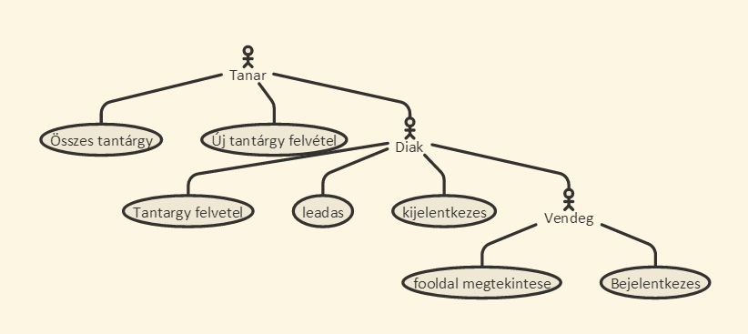

###Folyamatok
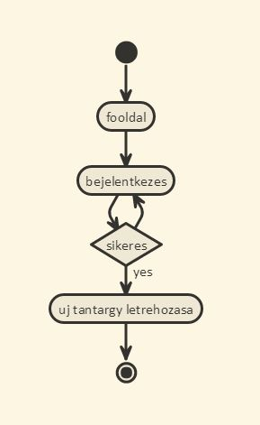

A fenti ábrán látható egy folyamat. A felhasználó megérkezik a főoldalra. Ezután lehetősége van átlépni a bejelentkező oldalra, ha a felhasználó sikeresen bejelentkezett akkor lehetősége van jelentkezni egy adott tantárgyhoz és azokat a tárgyakat megnézni ahova már jelentkezett.

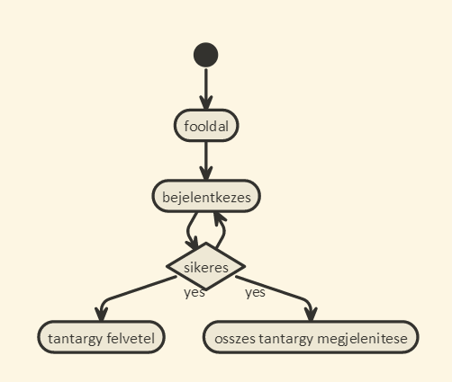

##Tervezés

###Oldaltérkép
Publikus:

- Főoldal
- Login

Tanuló

- Főoldal
- Login/Logout
- Tantárgylista
    + tantárgy jelenetkezes
    + összes tantárgy kilistázása

Tanár

- Főoldal
- Login/Logout
- Összes tantárgy lista
    + Tantárgy szerkesztése, törlése
- Új tantárgy felvétel

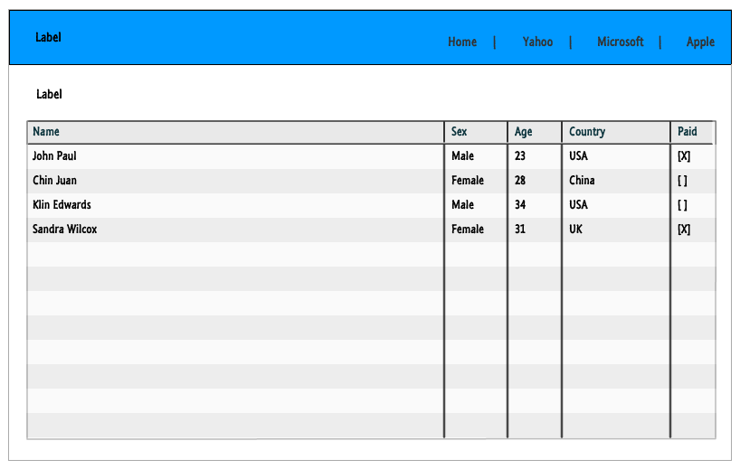

###Végpontok

- GET /: főoldal
- GET /welcome: bejelentkezes utani oldal
- GET /login: bejelentkező oldal
- POST /login: bejelentkezési adatok felküldése
- GET /login/signup : regisztrációs oldal
- POST /login/signup : regisztrációs adatok felküldése
- GET /student/mysubjects: felvett tárgyak
- GET /student/registrate: összes tantárgy listázása
- POST /student/registrate: tantárgy jelentkezés
- GET /teacher/all: összes tantárgy
- POST /teacher/all: tantárgy szerkesztés törlés
- GET /teacher/new: új tantárgy felvétele
- POST /teacher/new: új tantárgy felküldése
- GET /logout: kijelentkezes

###Adatbázisterv

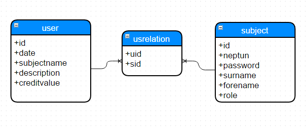

A fenti kép ábrázolja az adatbázis tervet. Az adatbázis 3 táblából áll.
- User
- usrelation
- subject
A usrelation tábla egy kapcsolótábla, erre azért volt szükség hogy egy user több tárgyat is feltudjon venni, viszont ezt a különböző diákok ne láthassák.

A subject tábla tartalma:
- id : Elsődleges kulcs.
- date : Ebben a mezőben tárolom a dátumot amikor az adott tantárgy létre lett hozva
- subjectname : A tantárgy neve.
- description : Tantárgy leírása.
- creditvalue : Tantárgy kreditértéke.

A user tábla tartalma:
- id : Elsődleges kulcs.
- neptun : A felhasználó neptun kódja.
- password : A felhasználó jelszava.
- surname : Vezetéknév.
- forename : Keresztnév.
- role : A felhasználó szerepe. Lehet tanár vagy diák.

##Tesztelés
A teszteléshez a mocha, chai modulokat használtam. És ezek segitségével teszteltem.

A user model egységtesztelésénél teszteltem hogy létretudunk-e hozni új felhasználót ezt updatelni és törölni.
Próbátlam egy adott usert megkeresni, és hogy a jelszava jól kódolható/dekódolható.

A funkcionális teszteléshez zombie.js-t használtam.
Ezenbelül teszteltem hogy az index jelenik meg amikor a felhasználó elösször meglátogatja az oldalt,
majd pedig teszteltem hogyha olyan oldalra próbál a felhasználó menni ahova nincs joga akkor a login page-re dobja.
És hogy itt sikeresen bejelentkezik-e a megadott paraméterekkel.

##Felhasználói dokumentáció
Az oldal a https://wtcscqbeadando.herokuapp.com oldalon érhető el.

###A futtatáshoz ajánlott hardver-, szoftver konfiguráció
A futtatáshoz ajánlott hardver: bármi amin elfut egy böngésző.
Ajánlott szoftver: Google Chrome

###Telepítés lépései
A felhasználó először meglátogatja a https://nodejs.org/en/#download oldalt és telepíti a node.js egy verzióját.

Ezekután a https://github.com/staraise/beadando oldalról letölti a projektet. 
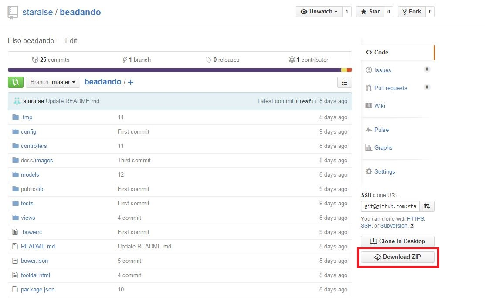

A letöltés után az adott zip-et ki kell tömöríteni egy erre alkalmas szoftverrel. Miután a nodejs telepítése befejeződött és a kitömörítés sikeres.

Ezekután a kitömöritett mappába el kell navigálni parancssorból. Ezután fel kell telepíteni a megfelelő modulokat:
Modulok:
 - bcryptjs
 - body-parser
 - connect-flash
 - express
 - express-session
 - express-validator
 - hbs
 - passport
 - passport-local
 - sails-disk
 - sails-memory
 - waterline
Egy modult úgy lehet feltelepíteni hogy: npm install <modulnév>. Miután végeztünk az összes modul telepítésével akkor futtatjuk a szervert a node server.js parancssal. Ezekután az oldal elérhető a http://localhost:3000/ címen.

###Program használata
A programot mint diákok vagy tanárok is használhatják.
Ha tanárként akarunk bejelentkezni akkor használjuk az admin felhasználó nevet admin jelszóval.
Ha diákként akkor vagy regisztrálunk egy újat vagy pedig wtcscq/asd.

Miután meglátogattuk az oldalt az üdvözlőkép fogad minket itt választhatunk hogy vagy bámuljuk és nem csinálunk semmit vagy pedig megpróbálunk belépni. Ha az adott látogató még nem regisztrált felhasználó akkor ezt megteheti ha a login képernyőre navigál és itt a registration gombra kattint.
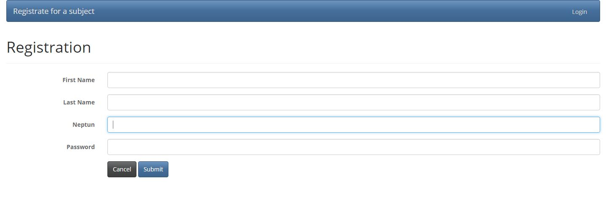
Ha a neptun kód még nem foglalt akkor a regisztráció sikeres és átirányít a bejelentkezett felhasználókat üdvözlő képernyőre.

## Diákként

Ha a bejelentkezett felhasználó diák akkor két lehetőség közül választhat a menüben. Vagy regisztrál meghirdetett tantárgyakra vagy pedig megnézi hogy milyen tárgyakat vett már fel.
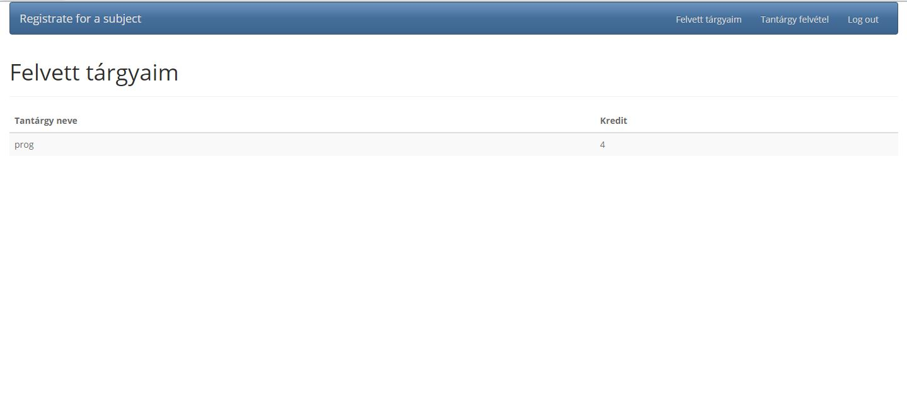
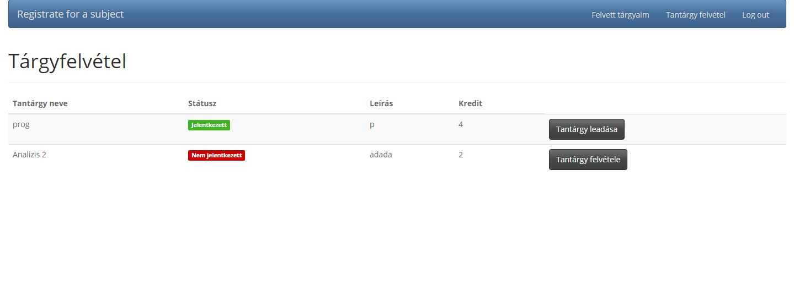

## Tanárként

Ha a bejelentkezett felhasználó tanár akkor két lehetőség közül választhat a menüben. Vagy létrehoz egy új tantárgyat vagy pedig az összes eddigi tantárgyat szerkeszti/megnézi.

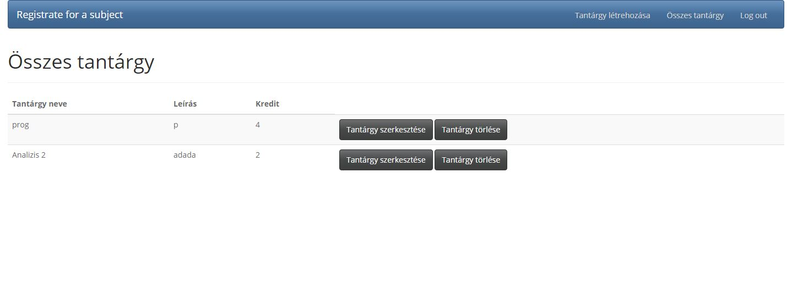
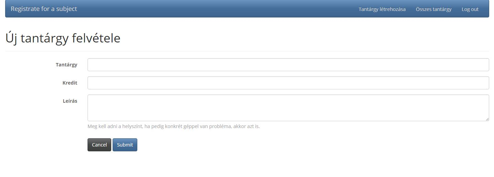

