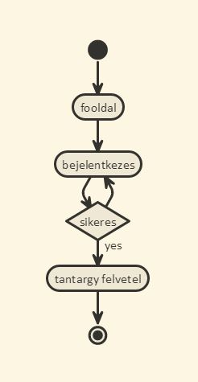

# Dokumentáció

##Követelmény analizis
###Funkcionális követelmények
- Tanulóként szeretnék tantárgyakat felvenni és leadni. --> Tantárgy felvétel
- Tanulóként szeretném ha láthatnám az eddig felvett tantárgyaim --> Felvett tárgyak
- Tanárként szeretném látni az összes tantárgyat.
- Tanárként szeretnék új tantárgyat létrehozni, szerkeszteni és törölni.
- A tanulók és a tanárok bejelentkezés után használhatják a funkciókat.
- A főoldalon az alkalmazás ismertetése jelenik meg.

###Nem funkcionális követelmények
- Felhasználóbarát, ergonomikus elrendezés és kinézet.
- Gyors működés.
- Biztonságos működés: jelszavak tárolása, funkciókhoz való hozzáférés.

###Szerepkörök

- vendég: a főoldal tartalmához fér hozzá.
- tanuló: a vendég szerepkörén túl tud tantárgyat felvenni.
- tanár: az összes tantárgyat látja és tud felvenni újat.

###Folyamatok

##Tervezés

###Oldaltérkép
Publikus:

- Főoldal
- Login

Tanuló

- Főoldal
- Login/Logout
- Tantárgylista
    + tantárgy jelenetkezes
    + összes tantárgy kilistázása

Tanár

- Főoldal
- Login/Logout
- Összes tantárgy lista
    + Tantárgy szerkesztése, törlése
- Új tantárgy felvétel

###Végpontok

- GET /: főoldal
- GET /welcome: bejelentkezes utani oldal
- GET /login: bejelentkező oldal
- POST /login: bejelentkezési adatok felküldése
- GET /login/signup : regisztrációs oldal
- POST /login/signup : regisztrációs adatok felküldése
- GET /student/mysubjects: felvett tárgyak
- GET /student/registrate: összes tantárgy listázása
- POST /student/registrate: tantárgy jelentkezés
- GET /teacher/all: összes tantárgy
- POST /teacher/all: tantárgy szerkesztés törlés
- GET /teacher/new: új tantárgy felvétele
- POST /teacher/new: új tantárgy felküldése
- GET /logout: kijelentkezes

###Adatbázisterv

##Tesztelés
A teszteléshez a mocha, chai modulokat használtam. És ezek segitségével teszteltem.

A user model egységtesztelésénél teszteltem hogy létretudunk-e hozni új felhasználót ezt updatelni és törölni.
Próbátlam egy adott usert megkeresni, és hogy a jelszava jól kódolható/dekódolható.

A funkcionális teszteléshez zombie.js-t használtam.
Ezenbelül teszteltem hogy az index jelenik meg amikor a felhasználó elösször meglátogatja az oldalt,
majd pedig teszteltem hogyha olyan oldalra próbál a felhasználó menni ahova nincs joga akkor a login page-re dobja.
És hogy itt sikeresen bejelentkezik-e a megadott paraméterekkel.
